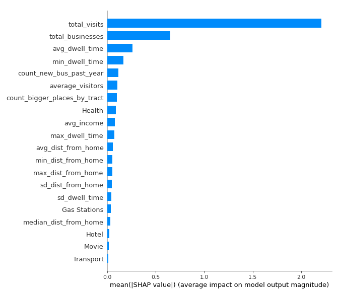
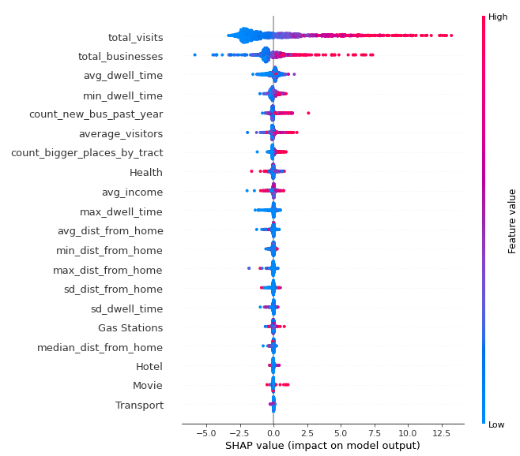
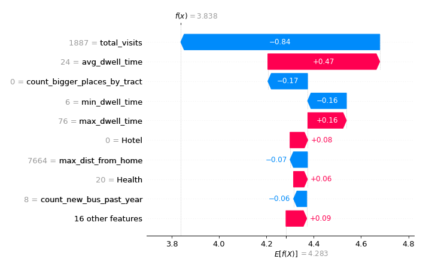
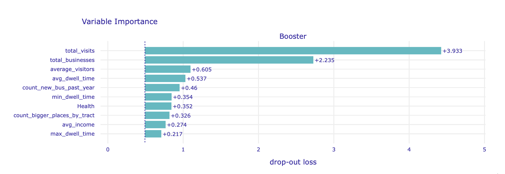
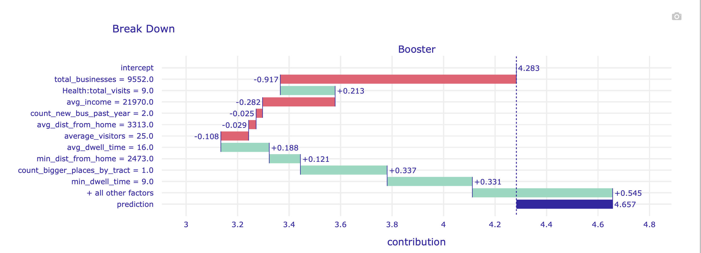
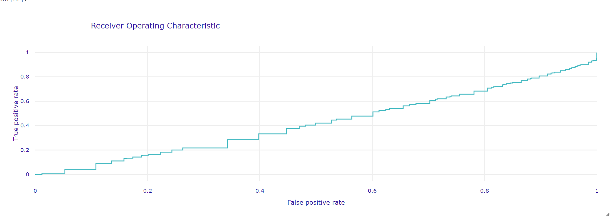
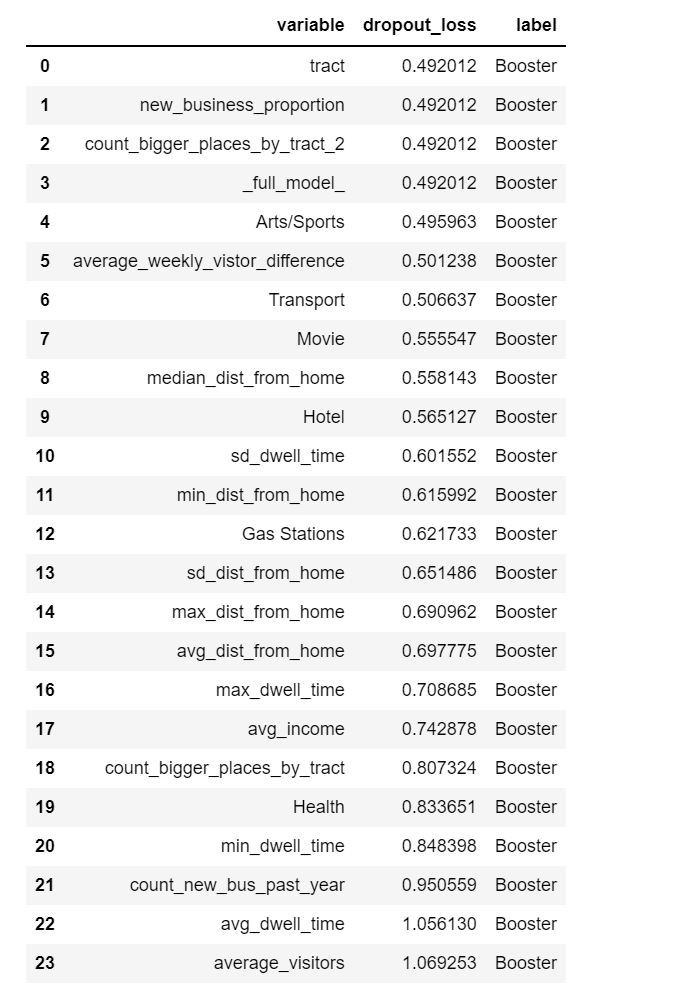
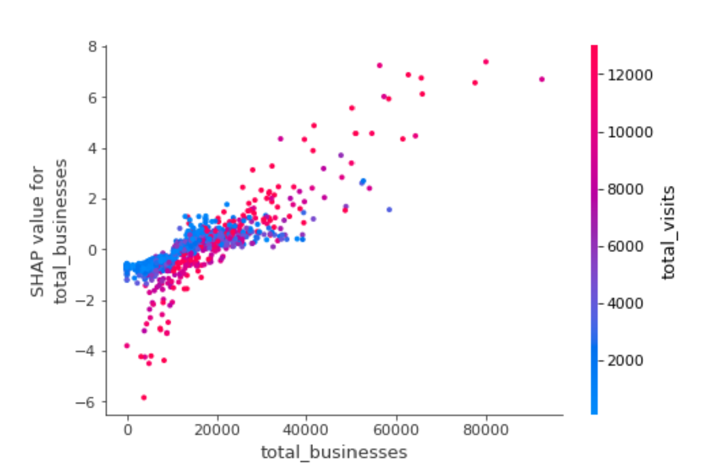
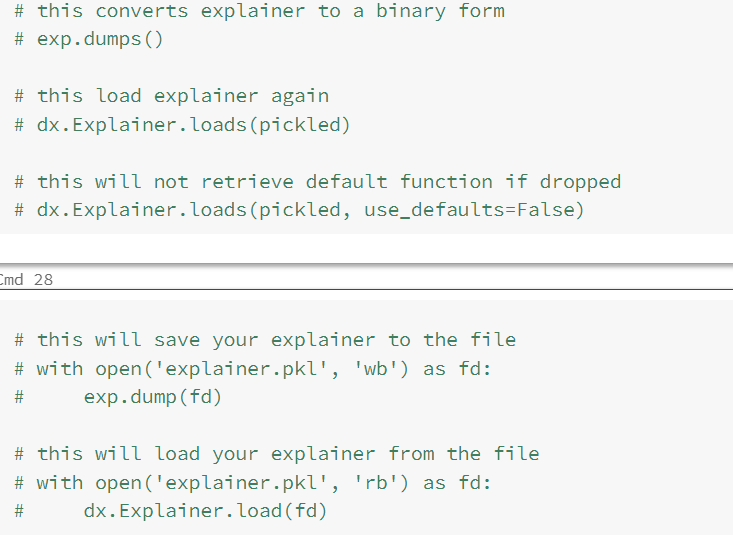

# Model Explainers

## Sample Code

Check out model_explainers.ipynb for the example code so you can follow along.

Alternatively, you can head to this [Model Explainers file in Databricks](https://adb-5187062830023627.7.azuredatabricks.net/?o=5187062830023627#notebook/3449113359366449/command/3449113359366450). *Make sure you make a copy* before you start editing this file so you can leave with your own code. If this link doesn't work for you, head to Databricks > Workspace > Team Presentations > Model Explainers.

## Model Explainers

Follow along with [our awesome presentation!](https://byui451.github.io/guide_model_explainers/index.html)

### What is a model explainer?  

Model explainers help explain the "black box" that are machine learning models.  
As we've been going in class, we've been generating hundreds of features. But training a model on so many features can be resource intensive. It can also take time to generate all those features. By figuring out the features that are most relevant to our model, we can focus on those. We could even drop our useless features (no correlation to the final output prediction) and generate more features that are like our most important features.  

Another advantage to model explainers is understanding individual instances that our model predicts. In statistics, we can understand things "on the average". That is to say, if someone was to apply for a loan, we can say "because most people that are approved for a loan have a credit score of 750, and your credit score is 700, you're unlikely to be approved for a loan". However, if we had a model explainer for a machine learning model that decides if you are approved for a loan, we could look at each factor that changes the final outcome, and how much it changes it by. We'll show an example of this more in later sections

### SHAP  

For more information about the math behind SHAP, [check out this website](https://christophm.github.io/interpretable-ml-book/shap.html).  
SHAP (SHapley Additive exPlanations) is a game theoretic approach to explain the output of any machine learning model. It connects optimal credit allocation with local explanations using the classic Shapley values from game theory and their related extensions. (Shapley values are a solution concept in cooperative game theory).

SHAP Values are used in the SHAP model explainer to show how each feature and value correlate the model output.

Here are a few examples of graphs and insights that SHAP can give. Check out the sample code for more information on how to create these graphs.

Some things to note: SHAP works best with decision tree and neural network models. While you can use it with KNN (or really, any other type of model), it's not as good. We won't be going over it in this training. If you're interested in knowing more, see [this StackOverflow post](https://stackoverflow.com/questions/62211302/obtaining-the-shap-values-for-a-prediction-made-with-knn).

### DALEX

Dalex is another package you can use to explain your macine learning model. It is actually very similar to Shap. You can use Dalex to check the importance of each feature, and how each feature contributes to the final prediction. 

Here are some examples from using Dalex to gain insights.

### Model-level explanations
This function calculates various Model Performance measures:

classification: F1, accuracy, recall, precision and AUC regression: mean squared error, R squared, median absolute deviation.

### What do we do with the information a model explainer gives us?

Once we have a model what information can we use it for. One of the most important parts of a model explainer is how 
we are able to see how individual features effect the outcome of the model. In the example of the being approved for a loan we 
could see if a feature like 'years of credit history' could negativly affect if someone is going to be approved for a loan. 
      
In the example of our model we can look at the shap values for the amount of buisnesses in a track and see how when we have more 
buisnesses in a track it has a strong positive atribute to the number of restrants we have in a track. Using model explainers like 
SHAP allows us to see if we have some information leakage from our target varialbe.

### Saving and loading Explainers

You can easily save an Explainer to the pickle (or generaly binary form) and load it again. Any local or lambda function in the Explainer object will be dropped during saving. Residual function by default is local, thus, if default, it is always dropped. Default functions can be retrieved during loading.

There are more graphs to explore. If you are interested in learning more about Dalex [check out this website](https://dalex.drwhy.ai/python/api/). Besides that, there is a YouTube video that will teach you how to use Dalex to create some insightful graphs. [Click on this!](https://www.youtube.com/watch?v=sezHr78xxoM)

### Other Model Explainers

There are more than just these two, but SHAP is one of the most widely used in the community and has the most support. DALEX also appears to be somewhat popular. LIME (Local Interpretable Model-Agnostic Explanations) and Microsoft’s InterpretML are two other model explainers that you could use. If you're interested in learning more, you ask your nearest search engine.
